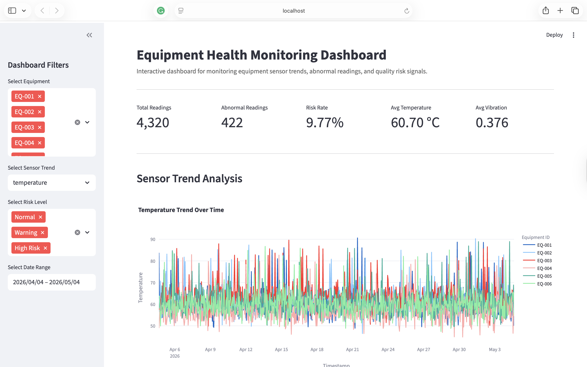
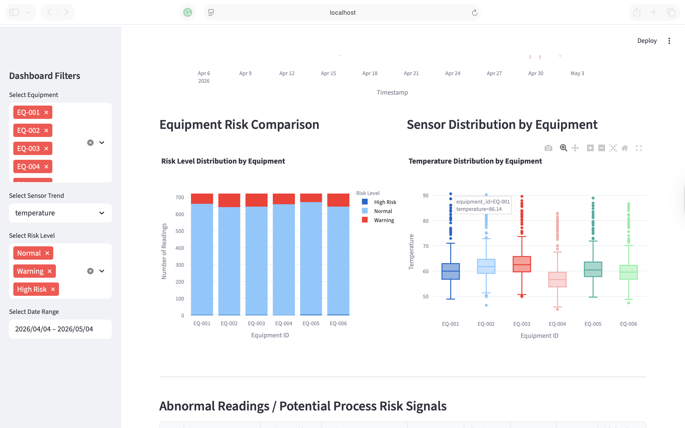
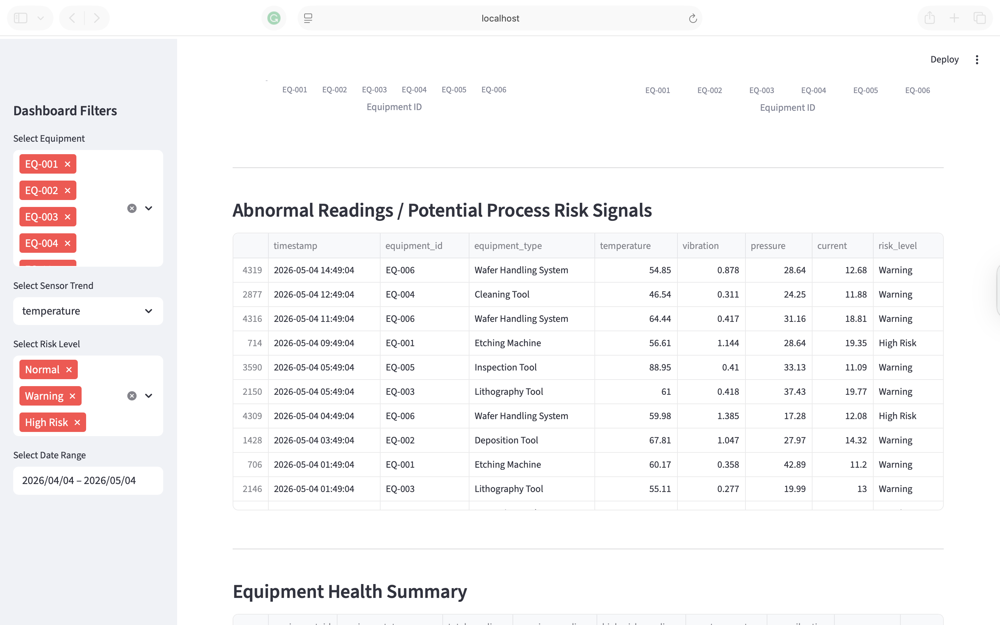
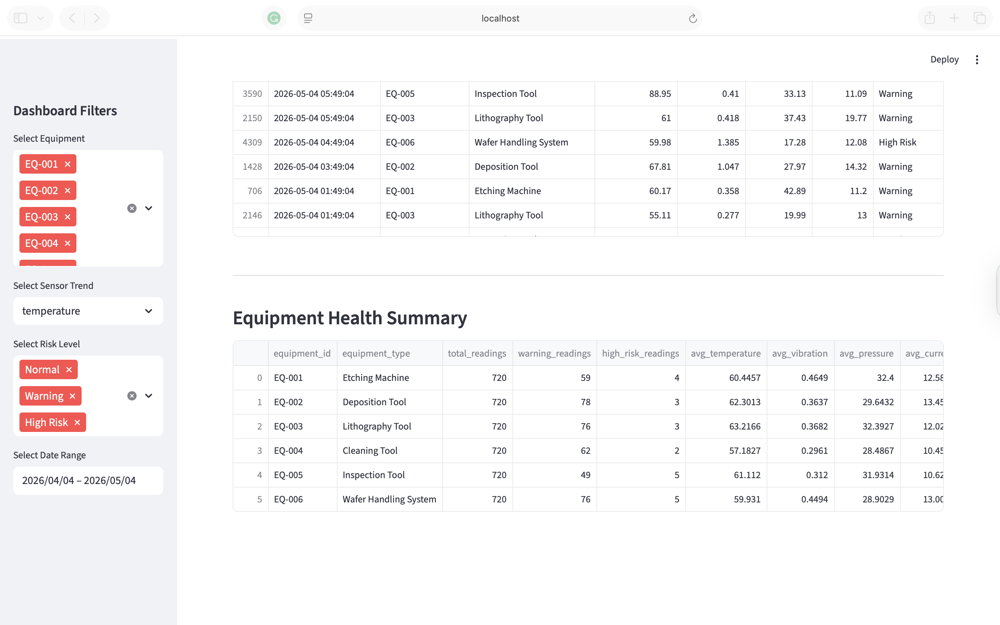

# Equipment Health Monitoring Dashboard

An interactive web-based dashboard for monitoring equipment sensor trends, detecting abnormal readings, and supporting manufacturing quality risk analysis.

This project simulates equipment health monitoring in a manufacturing environment using sensor readings such as temperature, vibration, pressure, and current. The dashboard helps users identify abnormal process signals, compare equipment conditions, and monitor potential quality risks.

---

## Project Overview

Modern manufacturing environments rely on continuous equipment monitoring to maintain process stability, reduce downtime, and improve quality control.

This project demonstrates how sensor data can be transformed into actionable insights through an interactive dashboard. The dashboard provides visual analytics for sensor trend monitoring, equipment comparison, abnormal reading detection, and quality risk review.

The project was built using **Python, Pandas, Streamlit, Plotly, and SQLite**.

---

## Live Demo

The dashboard is deployed on Streamlit Community Cloud and can be accessed here:

[View Live Demo](https://equipment-health-monitoring-dashboard.streamlit.app/)

---

## Key Features

- Interactive sensor trend visualisation for temperature, vibration, pressure, and current
- Equipment-level comparison across multiple machines
- Threshold-based abnormal reading detection
- Quality risk classification into Normal, Warning, and High Risk
- Abnormal readings table for reviewing potential process risk signals
- Equipment health summary with risk rate and average sensor metrics
- SQLite database integration for structured sensor data storage
- Web-based dashboard built with Streamlit and Plotly

---

## Tech Stack

- Python
- Pandas
- NumPy
- Streamlit
- Plotly
- SQLite

---

## Dashboard Preview

### Dashboard Overview



### Equipment Risk Comparison



### Abnormal Readings



### Equipment Health Summary



---

## Sensor Data

The dataset is synthetically generated to simulate equipment sensor readings from multiple manufacturing tools.

The generated dataset includes:

- Timestamp
- Equipment ID
- Equipment Type
- Temperature
- Vibration
- Pressure
- Current
- Abnormal Temperature Flag
- Abnormal Vibration Flag
- Abnormal Pressure Flag
- Abnormal Current Flag
- Risk Level

---

## Risk Detection Logic

The dashboard applies threshold-based monitoring logic to identify abnormal sensor behaviour.

Example abnormal thresholds:

| Sensor | Abnormal Condition |
|---|---|
| Temperature | Above 80°C |
| Vibration | Above 0.85 |
| Pressure | Below 25 or above 38 |
| Current | Above 18 |

Risk levels are classified as:

| Risk Level | Condition |
|---|---|
| Normal | No abnormal sensor readings |
| Warning | One abnormal sensor reading |
| High Risk | Two or more abnormal sensor readings |

---

## Dashboard Sections

### 1. KPI Overview

Displays key monitoring indicators such as:

- Total readings
- Abnormal readings
- Risk rate
- Average temperature
- Average vibration

### 2. Sensor Trend Analysis

Visualises sensor readings over time for selected equipment.

Supported sensor trends:

- Temperature
- Vibration
- Pressure
- Current

### 3. Equipment Risk Comparison

Compares the number of Normal, Warning, and High Risk readings across equipment.

### 4. Sensor Distribution by Equipment

Uses box plots to compare sensor distribution between equipment units.

### 5. Abnormal Readings Table

Displays detailed records of abnormal readings and potential process risk signals.

### 6. Equipment Health Summary

Summarises equipment-level health metrics, including average sensor values and risk rate.

---

## Project Structure

```text
equipment-health-monitoring-dashboard/
│
├── app.py
├── generate_data.py
├── equipment_health.db
├── requirements.txt
├── README.md
├── .gitignore
└── assets/
    ├── dashboard_overview.png
    ├── risk_comparison.png
    ├── abnormal_readings.png
    └── health_summary.png
```

---

## How to Run Locally

Clone this repository:

```bash
git clone https://github.com/vanessarasubala/equipment-health-monitoring-dashboard.git
cd equipment-health-monitoring-dashboard
```

Create and activate a virtual environment:

```bash
python3 -m venv .venv
source .venv/bin/activate
```

Install the required packages:

```bash
pip install -r requirements.txt
```

Generate the SQLite database:

```bash
python generate_data.py
```

Run the Streamlit app:

```bash
streamlit run app.py
```

---

## Deployment

This project can be deployed using Streamlit Community Cloud.

Deployment settings:

```text
Repository: vanessarasubala/equipment-health-monitoring-dashboard
Branch: main
Main file path: app.py
```

---

## Use Case

This project is relevant for manufacturing analytics, equipment health monitoring, quality engineering, and advanced process control use cases.

It demonstrates how sensor data can support:

- Process monitoring
- Equipment comparison
- Early abnormal signal detection
- Quality risk analysis
- Data-driven manufacturing decision-making
- Manufacturing dashboard development

---

## Relevance to Manufacturing Analytics

This project reflects how data analytics and visualisation can be applied in a manufacturing environment to monitor equipment condition and support process quality decisions.

By combining sensor data, threshold-based monitoring logic, and interactive dashboard design, the project provides a simple example of how manufacturing teams can identify abnormal process signals and review equipment performance more effectively.

---

## Author

**Vanessa Chriszella Rasubala**
